> dev, toying around with stuff and building.
> somewhere between git push and git regret.

I build backend services, apps, and deep learning.

<samp>javascript &nbsp; typescript &nbsp; react &nbsp; node &nbsp; python &nbsp; postgresql &nbsp; docker &nbsp; git &nbsp; linux</samp>

**[isa](https://github.com/drunkardleo-10/isa)** &nbsp;·&nbsp; <samp>swift</samp> 
A minimal macOS browser. 
4 stars, 0 forks, and actively maintained.

